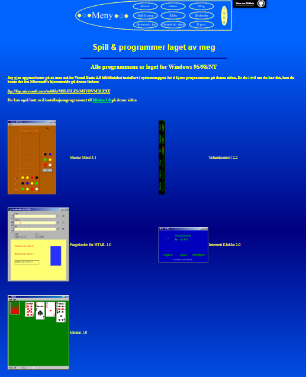

# My personal homepage from 1998

After seeing this TikTok video, I decided to publish my own first personal homepage again. I found three of my old homepages on an old backup DVD some years ago, and now they're all on GitHub and hosted for free on Azure Static Websites.

You can see my homepage from 1998 here [https://1998.eivindgl.com](https://1998.eivindgl.com). 
[](https://1998.eivindgl.com)

## TikTok video that inspired me
[](https://www.tiktok.com/@tamsininnit/video/7130172463735934214)
<blockquote class="tiktok-embed" cite="https://www.tiktok.com/@tamsininnit/video/7130172463735934214" data-video-id="7130172463735934214" style="max-width: 605px;min-width: 325px;" > <section>
<a target="_blank" title="@tamsininnit" href="https://www.tiktok.com/@tamsininnit">@tamsininnit</a> <a title="this" target="_blank" href="https://www.tiktok.com/tag/this">#This</a> is my 25th year as a front end web developer 😅 <a title="womenintech" target="_blank" href="https://www.tiktok.com/tag/womenintech">#womenintech</a> <a title="webdev" target="_blank" href="https://www.tiktok.com/tag/webdev">#webdev</a> <a title="millennial" target="_blank" href="https://www.tiktok.com/tag/millennial">#millennial</a> <a title="borninthe80s" target="_blank" href="https://www.tiktok.com/tag/borninthe80s">#borninthe80s</a> <a target="_blank" title="♬ Horror, suspense, weirdness, ghost, UFO - Zassh" href="https://www.tiktok.com/music/Horror-suspense-weirdness-ghost-UFO-6817169438580672514">♬ Horror, suspense, weirdness, ghost, UFO - Zassh</a> </section> </blockquote> 

` `

## 2000 and 2001 homepages
You're going to laugh at the design of the 1998 homepage, but my next homepage from 2000 is even worse. My 2001 homepage was much better, but it's no longer rendered perfectly in modern browsers.

 - [2000 homepage](https://github.com/eloekset/2000-homepage)
 - [2001 homepage](https://github.com/eloekset/2001-homepage)

## Techniques
Although the GitHub languages bar of this repo reports 0,8% CSS, this website actually conained zero CSS. I've just used some CSS to add a banner to link to the GitHub repo, which was not there originally. There's no other changes done to the source code.

The HTML code was written purely in a text editor. I don't acutally remember which editor I used back then, but I think it was just notepad.exe.

The main layout used framesets, which was a great way to separate the page in different elements, to keep the menu as a part separated from all of the acutal pages on the website.

If the browser didn't support frames, you just saw the black text on white background telling you to get a better browser:

```
<frameset noresize border=0 frameborder=0 framespacing=0  rows="170,100%">
<frame src="meny.htm" name="meny">
<frame src="hoved.htm" name="hoved">
<noframes>
<body>
skaff deg en bedre nettleser
</body>
</noframes>
</frameset>
```

Yes, it was bad, but this design worked fine on most screen resolutions, since there was only a top frame of 170 pixels and everything below was left for the real content. Both my 2000 and 2001 homepages used frameset in a different way, worse than this.

The menu layout used a `<table>` element with no borders to build a grid with left, top, right and bottom images and a lot of cells for buttons and spaces between the buttons. With borders enabled, the grid becomes visible.


The buttons has a hover over effect switching out which **.gif** file is displayed using JavaScript. The script didn't work on all browsers, and was programmed to work only for Netscape 3 and above, but at some time I decided to just assume all browsers supported this JavaScript anyway. Maybe that made the homepage fail on some browsers, maybe not. I guess I never tested it on other browsers.

```
browserName = navigator.appName;
browserVer = parseInt(navigator.appVersion);
	if (browserName == "Netscape" && browserVer >=3) {
        version = "n3";
	} else {
		version = "n2";
	}
	
    // First try to detect Netscape 3, but then just assume the browser supports this kind of JavaScript anyway... ;D
	version = "n3"
	if (version == "n3") {
        // build image objects for each button toggled on and off
        toc1on = new Image();
	    toc1on.src = "Meny/1.gif";

        toc1off = new Image();
	    toc1off.src = "Meny/1in.gif";

        // the same thing for every button...
    }

function img_act(imgName) {
	if (version == "n3") {
	imgOn = eval(imgName + "off.src");
	document [imgName].src = imgOn;
	}
}

function img_inact(imgName) {
	if (version == "n3") {
	imgOff = eval(imgName + "on.src");
	document [imgName].src = imgOff;
	}
}
```